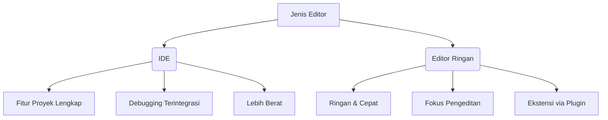

# Editor Kode untuk Pengembangan JavaScript

> **Tempat utama programmer bekerja** - Memilih editor yang tepat meningkatkan produktivitas secara signifikan

## Dua Jenis Utama Editor

### **IDE (Integrated Development Environment)**

**Karakteristik utama:**

- Beroperasi pada **tingkat proyek** (banyak file sekaligus)
- Navigasi antar file yang canggih
- Pelengkapan otomatis berbasis keseluruhan proyek
- Integrasi dengan VCS (Git), testing, dan alat lainnya

**Rekomendasi IDE Populer:**

| Editor                                               | Platform        | Lisensi                     | Badge                                                                                      |
| ---------------------------------------------------- | --------------- | --------------------------- | ------------------------------------------------------------------------------------------ |
| [Visual Studio Code](https://code.visualstudio.com/) | Lintas platform | Gratis                      |         |
| [WebStorm](https://www.jetbrains.com/webstorm/)      | Lintas platform | Berbayar                    |              |
| [Visual Studio](https://visualstudio.microsoft.com/) | Windows         | Berbayar (Gratis Community) |  |

### **Editor Ringan**

**Karakteristik utama:**

- Launch cepat dan responsif
- Fokus pada pengeditan file tunggal
- Dapat diperluas dengan plugin
- Minimalis dan mudah digunakan

**Rekomendasi Editor Ringan:**

| Editor                                       | Platform        | Lisensi   | Badge                                                                                |
| -------------------------------------------- | --------------- | --------- | ------------------------------------------------------------------------------------ |
| [Sublime Text](https://www.sublimetext.com/) | Lintas platform | Shareware |  |
| [Vim](https://www.vim.org/)                  | Lintas platform | Gratis    |                          |
| [Emacs](https://www.gnu.org/software/emacs/) | Lintas platform | Gratis    |                |
| [Notepad++](https://notepad-plus-plus.org/)  | Windows         | Gratis    |    |

## Perbandingan Fitur Utama

## Tips Memilih Editor

> "Pilihan editor bersifat **sangat pribadi** dan tergantung pada:
>
> - Jenis proyek yang dikerjakan
> - Kebiasaan kerja individu
> - Preferensi antarmuka pengguna"

### Rekomendasi Berdasarkan Kasus:

- **Pengembangan Frontend Modern**: [VS Code](https://code.visualstudio.com/) (ekosistem ekstensi kaya)
- **Pengembangan Enterprise**: [WebStorm](https://www.jetbrains.com/webstorm/) atau [Visual Studio](https://visualstudio.microsoft.com/)
- **Pengeditan Cepat**: [Sublime Text](https://www.sublimetext.com/)
- **Pengguna Lanjutan**: [Vim](https://www.vim.org/) atau [Emacs](https://www.gnu.org/software/emacs/)

## Credit & Referensi

### Pengembang Utama

| Perusahaan/Proyek         | Kontribusi             | Badge                                                                                            |
| ------------------------- | ---------------------- | ------------------------------------------------------------------------------------------------ |
| **Microsoft**             | VS Code, Visual Studio |                 |
| **JetBrains**             | WebStorm, IntelliJ     |                    |
| **Sublime HQ**            | Sublime Text           |                |
| **Komunitas Open Source** | Vim, Emacs             |  |

### Sumber Belajar

  
  

> "Cobalah beberapa editor sebelum memutuskan. Versi trial/trial biasanya tersedia untuk editor berbayar!"

### Alat Pendukung

  
