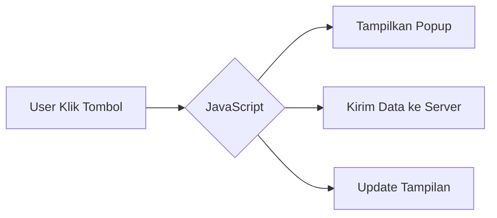
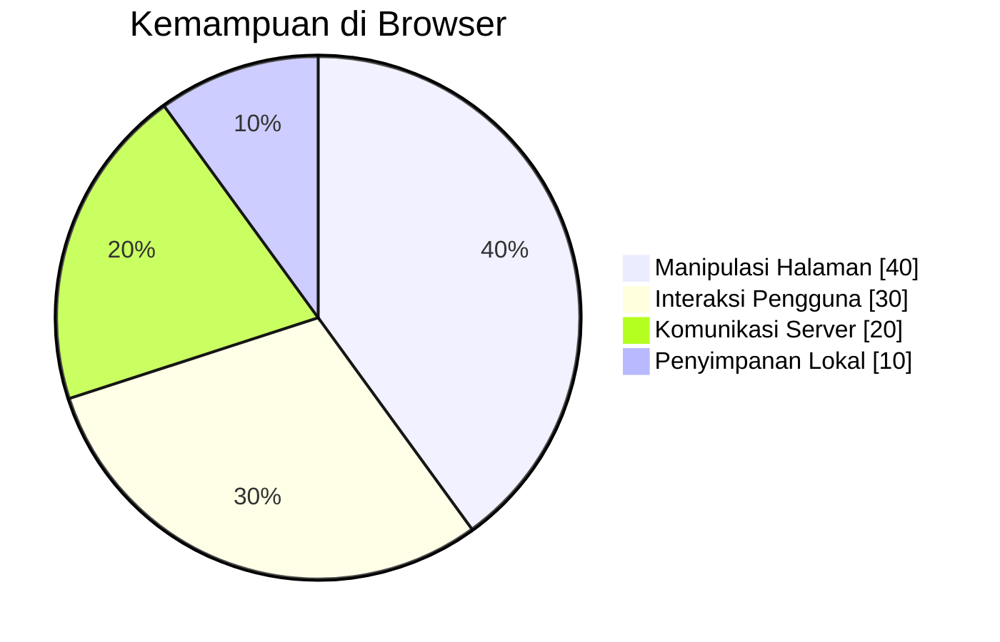
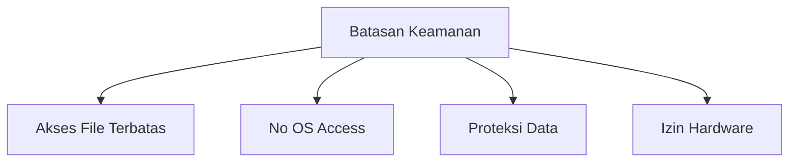

# Pengenalan JavaScript

> **Tutorial ini akan membahas:**
>
> - Apa itu JavaScript dan fungsinya
> - Kemampuannya di berbagai lingkungan
> - Batasan keamanan di browser

  
  
  

## Apa itu `JavaScript`?

JavaScript adalah bahasa scripting yang **"menghidupkan" website** dengan menambahkan:

- **Interaktivitas** (tombol, form, animasi)
- **Logika dinamis** (pemrosesan data real-time)
- **Komunikasi asinkron** (mengambil data tanpa reload)

**Contoh praktis:**

### Fakta menarik:

- **Multi-platform**: Berjalan di browser, server (Node.js), dan desktop
- **Zero-install**: Sudah terintegrasi di semua browser modern
- **Ekstensif**: Mendukung aplikasi web, mobile, game, hingga IoT

## Apa yang Dapat Dilakukan JavaScript?

### Di Browser

- Mengubah konten/halaman secara dinamis
- Merespons event (klik, input, scroll)
- Berkomunikasi dengan server web
- Menyimpan data lokal (cookies, localStorage)

### Di Server (Node.js)

- Akses filesystem (baca/tulis file)
- Berinteraksi dengan database
- Menjalankan proses background
- Membuat API server

## Batasan JavaScript di Browser

**Detail pembatasan:**

1.  **Akses file terbatas**  
    Hanya melalui input pengguna (`<input type="file">` atau drag-n-drop)

2.  **Tidak bisa akses OS langsung**  
    Tidak dapat menjalankan program sembarangan

3.  **Proteksi data sensitif**  
    Diblokir akses lintas tab/domain tanpa izin

4.  **Akses hardware butuh izin**  
    Kamera/mikrofon/lokasi memerlukan persetujuan pengguna

> **Alasan:** Melindungi pengguna dari halaman web berbahaya!

---

  <h3> Referensi & Sumber Terkait</h3>
  
  
  

